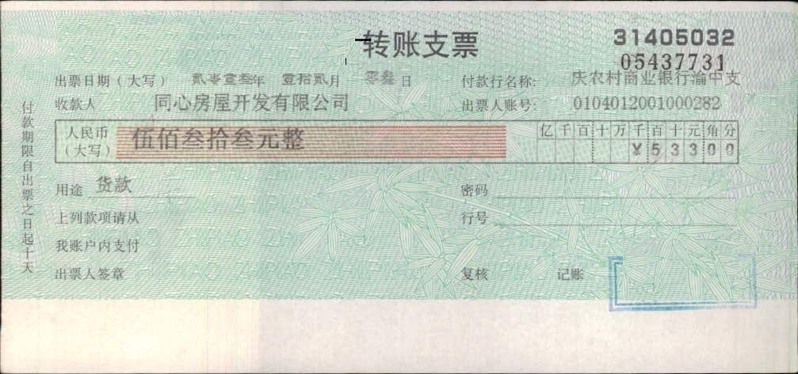
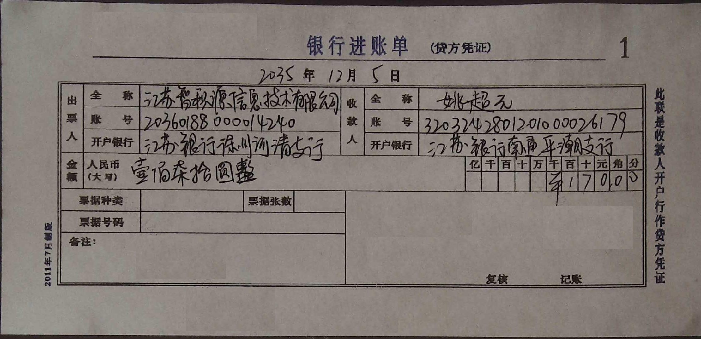

# ocr_services
手写文字OCR识别模型,均是自主训练开发的模型，目前以下三个功能进行开源：
- 通用场景下手写文字的识别
- 银行支票OCR识别
- 银行进账单OCR识别
  
其它票据（营业执照、电子承兑汇票、发票、医疗票据等等）、pdf、表格等功能会在后续逐步开放。

## 代码结构
- common: 通用的一些函数；
- net: 包含文字检测模型和识别模型的代码；
- service：基于net模型搭建的文字ocr功能服务，如支票和进账单的OCR识别；
- structure：文字识别结果结构化；
- test_datas：测试数据
- text_processing：识别出来的文字的处理，如字段性文字的纠错；

## 功能说明
1. 通用场景下手写文字识别
  <div align="center">
    
  </div>
基于深度学习模型，自主训练开发的手写文字的识别，可以对切割好的单行文字尽心文字识别，方便进行文字的录入。

2. 银行支票OCR识别
  <div align="center">
    
  </div>
银行支票的文字信息的提取，通过文字的定位、识别和结构化后，得到提取后的支票信息。模型兼容机打文字和手写文字；

    支票结构化后的字段如下表所示：

    | key            | 对应字段     |
    | :------------- | :----------- |
    | voucher_no_1   | 支票号码1    |
    | voucher_no_2   | 支票号码2    |
    | issue_date     | 出票日期     |
    | payer_bank     | 付款行名称   |
    | payee_name     | 收款人名称   |
    | payer_account  | 出票人账号   |
    | amount_chinese | 金额（大写） |
    | amount         | 金额（小写） |
    | purpose        | 用途         |
    | password       | 支付密码     |
    | bank_no        | 行号         |
    |                |
    
    输出结构样例如下：
    ```json
    {
        'ocr_type': 'T_BANK_CHEQUE', 
        'logid': '0', 
        'content': [
            {'key': 'voucher_no_1', 'value': '31405032', 'score': 0.9894}, 
            {'key': 'voucher_no_2', 'value': '05437731', 'score': 0.9605}, 
            {'key': 'issue_date', 'value': '20131203', 'score': 0.35834}, 
            {'key': 'payer_bank', 'value': '庆农村商业银行渝中支', 'score': 0.9974}, 
            {'key': 'payee_name', 'value': '同心房屋开发有限公司', 'score': 0.9925}, 
            {'key': 'payer_account', 'value': '0104012001000282', 'score': 0.9926}, {'key': 'amount_chinese', 'value': '伍佰叁拾叁元整', 'score': 0.9994}, 
            {'key': 'amount', 'value': '533.00', 'score': 0.9982}, 
            {'key': 'purpose', 'value': '货款', 'score': 0.8195}, {'key': 'password', 'value': '', 'score': 0.0}, 
            {'key': 'bank_no', 'value': '', 'score': 0.0}
        ]
    }
    ```

3. 银行进账单OCR识别
  <div align="center">
    
  </div>
银行进账单的文字信息的提取，通过文字的定位、识别和结构化后，得到提取后的支票信息。模型兼容机打文字和手写文字；

    支票结构化后的字段如下表所示：

        | key            | 对应字段     |
        | :------------- | :--------- |
        | issue_date     | 出票日期    |
        | payer_name     | 出票人全称   |
        | payer_account  | 出票人账号   |
        | payer_bank     | 出票人行名   |
        | payee_name     | 收款人全称   |
        | payee_account  | 收款人账号   |
        | payee_bank     | 收款人行名   |
        | amount_chinese | 金额（大写） |
        | amount         | 金额（小写） |
        | remark         | 备注        |
        |
    
    输出结构样例如下：
    ```json
    {
        'ocr_type': 'T_BANK_INCOME', 
        'logid': '0', 
        'content': [
            {'key': 'invoice_name', 'value': '2035125', 'score': 0}, 
            {'key': 'invoice_page', 'value': '', 'score': 0}, 
            {'key': 'code', 'value': '20360188000014240', 'score': 0}, {'key': 'seq', 'value': '', 'score': 0}, 
            {'key': 'code_print', 'value': '', 'score': 0}, 
            {'key': 'seq_print', 'value': '3203242801201000026179', 'score': 0}, 
            {'key': 'issue_date', 'value': '', 'score': 0}, 
            {'key': 'payer_name', 'value': '壹佰柒拾圆整', 'score': 0}, 
            {'key': 'payer_tax_id_num ', 'value': '17000', 'score': 0}, {'key': 'payer_address_phone', 'value': '', 'score': 0.0}, 
            {'key': 'payer_bank_account', 'value': '', 'score': 0.0}, 
            {'key': 'detail', 'value': '', 'score': 0.0}, 
            {'key': 'amount_no_tax', 'value': '', 'score': 0.0}, 
            {'key': 'amount_tax', 'value': '', 'score': 0.0}, 
            {'key': 'amount_chinese', 'value': '', 'score': 0.0}, 
            {'key': 'amount', 'value': '', 'score': 0.0}, 
            {'key': 'payee_name', 'value': '', 'score': 0.0}, 
            {'key': 'payee_tax_id_num ', 'value': '', 'score': 0.0}, 
            {'key': 'payee_address_phone', 'value': '', 'score': 0.0}, 
            {'key': 'payee_bank_account', 'value': '', 'score': 0.0}, 
            {'key': 'remark', 'value': '', 'score': 0.0}, 
            {'key': 'staff', 'value': '', 'score': 0.0}, 
            {'key': 'machine_num', 'value': '', 'score': 0.0}, 
            {'key': 'check_num', 'value': '', 'score': 0.0}
        ]
    }
    ```
## 使用方法
- 使用环境： python3.7
- 安装依赖
  安装requirements.txt中的依赖包。
- demo使用
```
python main.py
```
main.py的main函数中已经指定了test_datas目录下的图片，如果要测试，修改买函数中图片的路径即可。


## 问题
如果有疑问欢迎与我联系（lubo@nodeinit.com），
如有业务需要，也欢迎与我联系。
